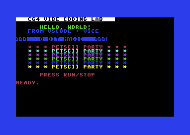

# C64 BASIC Pipeline (VICE + VS Code)

A minimal, reproducible Commodore 64 BASIC build environment for macOS using VICE tools.

This project:
- tokenizes ASCII BASIC (`.bas`) to C64 BASIC v2 program (`.prg`) via `petcat`
- builds a fresh disk image (`.d64`) and writes the program via `c1541`
- runs in `x64sc` in live mode (keep emulator open) or timed mode (auto-exit with screenshot/log capture)

## Prerequisites

- macOS
- [Homebrew](https://brew.sh/)
- VICE tools on `PATH`

Install VICE:

```bash
brew install vice
```

Verify tools:

```bash
command -v x64sc petcat c1541
```

Expected output includes paths for all three binaries.

## Project Structure

```text
src/                 BASIC source files
scripts/             build/run scripts
build/               generated .prg and .d64
artifacts/           run logs, screenshots, status files
.vscode/tasks.json   VS Code task integration
Makefile             command entry points
```

## Quick Start

Build and run live (keeps emulator open):

```bash
make run
```

Build and run timed pipeline (auto-exit):

```bash
make run-timed
```

Clean outputs:

```bash
make clean
```

## Program Preview



## Make Targets

- `make build`: `src/hello.bas` -> `build/hello.prg`
- `make d64`: creates `build/hello.d64` and writes `HELLO`
- `make run`: live mode (no cycle limit, no forced exit screenshot)
- `make run-live`: alias for live mode
- `make run-timed`: timed mode (`-limitcycles`), writes artifacts
- `make clean`: removes `build/` and `artifacts/`

## VS Code Integration

Configured tasks in `.vscode/tasks.json`:

- `C64: Build PRG`
- `C64: Build D64`
- `C64: Run (VICE Pipeline)` (timed mode)
- `C64: Run Live (Keep Open)` (default build task)
- `C64: Clean`

Usage:

1. Open this folder in VS Code.
2. Press `Cmd+Shift+B` to run the default build task (live mode).
3. Use `Cmd+Shift+P` -> `Tasks: Run Task` to run any specific task.

If task behavior seems stale after edits, run `Developer: Reload Window`.

## Outputs

Live mode:
- `artifacts/vice-live.log`

Timed mode:
- `artifacts/vice.log`
- `artifacts/vice-exit.png`
- `artifacts/run_status.txt`

## Notes

- BASIC keywords should stay lowercase in ASCII source for reliable tokenization.
- Timed mode may report a VICE non-zero exit when cycle limit is reached; pipeline handling normalizes this in `run_status.txt`.
- `c1541` may print `OPENCBM` dynamic library warnings on macOS Homebrew installs; `.d64` creation still works for this workflow.

## Next Step (Debugging)

When ready, add a `launch.json` debug configuration for `x64sc` and monitor integration. This repo is already structured so debug configs can reuse the same `make d64` / `make run` flow.
