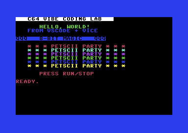

# C64 BASIC + Assembly Pipeline (VICE + VS Code)

A reproducible Commodore 64 development environment for macOS using VICE tools for both BASIC and assembly.

This project:
- tokenizes ASCII BASIC (`.bas`) to C64 BASIC v2 program (`.prg`) via `petcat`
- assembles KickAssembler source (`.asm`) into a `.prg` with a BASIC `SYS` stub via `BasicUpstart2`
- builds a fresh disk image (`.d64`) and writes the program via `c1541`
- runs in `x64sc` in live mode (keep emulator open) or timed mode (auto-exit with screenshot/log capture)
- supports VICE/VS64 debugging for both BASIC and assembly builds

## Prerequisites

- macOS
- [Homebrew](https://brew.sh/)
- VICE tools on `PATH`
- Java runtime for KickAssembler

Install the macOS toolchain:

```bash
brew install vice openjdk
```

Verify tools:

```bash
command -v x64sc petcat c1541
/opt/homebrew/opt/openjdk/bin/java -version
```

Expected output includes paths for the VICE tools plus a working Java runtime.

KickAssembler is downloaded from its official site on first assembly build into `tools/KickAssembler/`.

## Recommended Stack

For a developer-focused macOS setup, this repo now uses:

- VICE `x64sc` for emulation and remote debugging
- KickAssembler for 6510 assembly with a BASIC launcher stub
- VS64 for VS Code build/debug integration

`acme` and `cc65` are both available through Homebrew and work on macOS, but KickAssembler is the best fit here because it combines a strong C64-specific workflow with `BasicUpstart2`, symbol output, and smooth VICE/VS64 integration.

## Project Structure

```text
src/                 BASIC and assembly source files
scripts/             build/run scripts
build/               generated .prg and .d64
artifacts/           run logs, screenshots, status files
.vscode/tasks.json   VS Code task integration
Makefile             command entry points
```

## Quick Start

Build and run BASIC live (keeps emulator open):

```bash
make run
```

Build and run assembly live:

```bash
make run-asm
```

Build and run the timed pipelines (auto-exit):

```bash
make run-timed
make run-asm-timed
```

Verify the assembly target in console mode without opening the GTK window:

```bash
make verify-asm
```

Run the assembly autoplay smoke test:

```bash
make playtest-asm
```

Run the assembly autoplay smoke test with the VICE window visible:

```bash
make playtest-asm-visible
```

Clean outputs:

```bash
make clean
```

## Program Preview



## BASIC Targets

- `make build`: `src/hello.bas` -> `build/hello.prg`
- `make d64`: creates `build/hello.d64` and writes `HELLO`
- `make run`: BASIC live mode
- `make run-live`: BASIC live alias
- `make run-timed`: BASIC timed mode

## Assembly Targets

- `make build-asm`: `src/hello-asm.asm` -> `build/hello-asm.prg`
- `make d64-asm`: creates `build/hello-asm.d64` and writes `HELLOASM`
- `make run-asm`: assembly live mode
- `make run-asm-live`: assembly live alias
- `make run-asm-timed`: assembly timed mode
- `make verify-asm`: assembly console verification for sandbox/headless use
- `make playtest-asm`: faster binary-monitor autoplay smoke test without per-sample host screenshots
- `make playtest-asm-visible`: binary-monitor autoplay smoke test with visible VICE window and per-sample host screenshots
- `make capture-gameplay-frames`: build the assembly target, record `5` seconds of the visible VICE window, and dump every captured frame to `artifacts/gameplay-capture/frame-dump/frames/`
- `make preview-sprites`: regenerate the enemy subset, full arcade sprite bank, player sprite layers, and player explosion bank, then render SVG previews to `artifacts/enemy-sprites-preview.svg`, `artifacts/arcade-sprites-preview.svg`, `artifacts/player-sprite-preview.svg`, and `artifacts/player-explosion-preview.svg`
- `make debug-sprites`: print the generated enemy frames as ASCII and also regenerate the sprite previews
- `make convert-sprites-png2prg`: normalize the first 3x3 enemy block from the full arcade sheet for `png2prg`, run the conversion row-by-row, and write `src/generated_enemy_sprites_png2prg.bin`

The assembly build now uses the character renderer for the in-formation enemy pack. The temporary sprite-pack fallback has been removed.

## Sprite Workflow

The sprite pipeline now uses `ArcadeGalaxianSprites.png` as the source of truth.
The first `3x3` sprites on that full sheet are extracted into the in-game enemy bank, and the whole sheet is also exported as a separate asset bank.
The end-to-end process is documented in [`docs/arcade-sprite-pipeline.md`](/Users/david/Documents/c64/c64-vibe-coding/docs/arcade-sprite-pipeline.md).

The enemy subset generation produces:

- `src/generated_enemy_sprites.asm`: human-readable KickAssembler data for inspection and debugging
- `src/generated_enemy_sprites.bin`: raw `64-byte` C64 sprite data that [`hello-asm.asm`](/Users/david/Documents/c64/c64-vibe-coding/src/hello-asm.asm#L1072) imports directly

The full-sheet export produces:

- `src/generated_arcade_sprites.asm`: readable KickAssembler blocks for every extracted arcade asset layer
- `src/generated_arcade_sprites.bin`: raw sprite bank for the entire sheet
- `src/generated_arcade_sprites.json`: metadata that maps asset labels to one or more sprite layers for previewing or tooling

The player-only extraction path also produces:

- `src/generated_player_sprite.asm`: readable copy of the layered player ship
- `src/generated_player_sprite.bin`: red player base layer
- `src/generated_player_overlay.bin`: white player overlay layer
- `src/generated_player_extra.bin`: cyan player overlay layer
- `src/generated_player_explosion.asm`: readable `4x` frame player explosion metasprite bank
- `src/generated_player_explosion.bin`: raw `16`-sprite player explosion bank

Those raw binary formats are the useful interchange point with external tools such as SpritePad, SpriteMate, or Master of Sprites: once a tool can export standard C64 sprite bytes, the game can read the result without re-encoding it as assembly text.
The current mapper preserves the source sprite pixels 1:1 inside the C64 multicolor sprite grid. It no longer rescales the sheet cells; it copies the extracted rows directly and only trims blank horizontal margin when a `16`-pixel source cell has to fit the `12` logical multicolor columns.
The full-sheet exporter keeps each band segmented by the sheet's gray separator lines, so the non-uniform source layout still maps cleanly into individual C64 assets. The current export yields `55` assets as `64` sprite layers.
The assembly build only regenerates these files from `ArcadeGalaxianSprites.png` when the PNG is newer or the generated files are missing, so a sprite editor can overwrite `src/generated_enemy_sprites.bin` without the next build immediately undoing it.

There is also a repo-local `png2prg` path:

- `tools/bin/png2prg`: official converter built locally from source
- `scripts/build_png2prg_enemy_sheet.py`: extracts the first `3x3` enemy block from the full arcade sheet and converts it into `png2prg`-friendly `24x21` sprite rows using exact `png2prg` palette colors
- `scripts/convert_enemy_sprites_with_png2prg.sh`: runs three row-wise `png2prg` passes and concatenates them into `src/generated_enemy_sprites_png2prg.bin`

The current `png2prg` output byte-matches `src/generated_enemy_sprites.bin`.

## Assembly Stage 2 Shell

The default assembly target lives at `src/hello-asm.asm`.

It uses KickAssembler's `BasicUpstart2(start)` macro to generate the BASIC stub at `$0801`, then jumps into the machine-code entry point at `$1000`. The program now serves as the Stage 2 Galaxian-style shell: it initializes a stable text screen, reserves a HUD row for future score/lives work, keeps one alien moving across the top of the playfield, and adds a player ship at the bottom that moves left and right from joystick port 2.

## Assembly Autoplay

The repo includes an external autoplay/playtest path for the current Galaxian shell.

- `scripts/playtest_asm.py` launches the normal `build/hello-asm.prg` in visible VICE, connects to the VICE binary monitor for low-frequency hardware sampling, and drives the player with real macOS key events.
- The playtest generates a temporary VICE symbolic keymap so host `Left`/`Right` keys act as joystick port 2.
- Assertions are based on generic C64 hardware state only: joystick port 2 input and VIC sprite registers. No autoplay-specific code is compiled into the game.
- The harness tries to capture host window screenshots at each sample when macOS Screen Recording is available, and VICE always writes a final exit screenshot as a visual artifact.

This path is intentionally human-like on the input side and low-intrusion on the verification side: the game is exercised through normal joystick input, while the monitor is sampled about once per second so the emulator stays visually smooth.

## VS Code Integration

Configured tasks in `.vscode/tasks.json`:

- `C64: Build PRG`
- `C64: Build D64`
- `C64: Run (VICE Pipeline)` (timed mode)
- `C64: Run Live (Keep Open)` (default build task)
- `C64 ASM: Build PRG`
- `C64 ASM: Build D64`
- `C64 ASM: Autoplay Smoke Test`
- `C64 ASM: Autoplay Smoke Test (Visible)`
- `C64 ASM: Run (VICE Pipeline)`
- `C64 ASM: Run Live (Keep Open)`
- `C64: Clean`

Usage:

1. Open this folder in VS Code.
2. Press `Cmd+Shift+B` to run the default build task (live mode).
3. Use `Cmd+Shift+P` -> `Tasks: Run Task` to run any specific task.

If task behavior seems stale after edits, run `Developer: Reload Window`.

## Outputs

Live mode:
- `artifacts/vice-live.log`

Timed mode:
- `artifacts/vice.log`
- `artifacts/vice-exit.png`
- `artifacts/run_status.txt`

Assembly console verification:
- `artifacts/vice-asm-console.log`
- `artifacts/run_status_asm_console.txt`

Assembly autoplay smoke test:
- `artifacts/playtest-asm.log`
- `artifacts/playtest-asm.json`
- `artifacts/playtest-asm-vice.log`
- `artifacts/playtest-asm-frames/`
- `artifacts/playtest-asm-exit.png`

Visible assembly autoplay smoke test:
- `artifacts/playtest-asm-visible.log`
- `artifacts/playtest-asm-visible.json`
- `artifacts/playtest-asm-visible-vice.log`
- `artifacts/playtest-asm-visible-frames/`
- `artifacts/playtest-asm-visible-exit.png`

Gameplay frame capture:
- `artifacts/gameplay-capture/gameplay.mp4`
- `artifacts/gameplay-capture/summary.json`
- `artifacts/gameplay-capture/ffmpeg.log`
- `artifacts/gameplay-capture/vice.log`
- `artifacts/gameplay-capture/frame-dump/summary.json`
- `artifacts/gameplay-capture/frame-dump/frames/`

## Notes

- BASIC keywords should stay lowercase in ASCII source for reliable tokenization.
- Timed mode may report a VICE non-zero exit when cycle limit is reached; pipeline handling normalizes this in `run_status.txt`.
- `c1541` may print `OPENCBM` dynamic library warnings on macOS Homebrew installs; `.d64` creation still works for this workflow.
- In Codex or other sandboxed environments, VICE GUI targets may require running outside the sandbox to access macOS display services. Use `make verify-asm` for non-GUI verification, and use `make run-asm` / `make run-asm-timed` from a normal host session for interactive/manual testing.
- `make playtest-asm` and `make playtest-asm-visible` are macOS GUI playtests. They need the shell host app to have Accessibility permission for `System Events` keyboard control. Screen Recording is only needed for the optional per-sample host screenshots.
- `make capture-gameplay-frames` also needs macOS Screen Recording permission, because it records the visible VICE window through AVFoundation before dumping the captured video into per-frame PNGs.
- The playtest still uses the VICE binary monitor on `127.0.0.1:6502` for generic hardware reads. In a sandboxed Codex session that localhost socket may require escalated permissions; on a normal local macOS shell it runs directly.

## Debugging in VS Code (BASIC step-through)

This repo supports integrated BASIC and assembly debugging through VS64 + the VICE binary monitor.

### One-time setup

1. Install VS64 extension: `rosc.vs64` (workspace recommends it automatically).
2. Ensure VICE is installed and `x64sc` is on `PATH`:

```bash
brew install vice openjdk
```

### Debug flow

1. Open either `src/hello.bas` or `src/hello-asm.asm`.
2. Click the gutter to set a breakpoint.
3. Press `F5`.
4. Choose `Debug Active C64 File (VICE / VS64)`.

Expected behavior:
- If the active file is `hello.bas`, VS Code builds `build/hello.prg` and launches that.
- If the active file is `hello-asm.asm`, VS Code builds `build/hello-asm.prg` and launches that.
- For assembly, VS64 resolves labels from `build/hello-asm.sym`.

### Attach flow (optional)

1. Open the `.bas` or `.asm` file you want to debug.
2. Run task: `C64: Start VICE Debug Server For Active Source`.
3. Press `F5`.
4. Choose `Attach to VICE (Active C64 File / VS64)`.

### Troubleshooting

- If VS64 cannot connect, check port `6502` is free, then keep `.vscode/settings.json` and `.vscode/launch.json` ports aligned.
- `F5` follows the active editor now; if the wrong program launches, make sure the `.bas` or `.asm` tab you want is focused before starting debug.
- If ASM breakpoints do not hit, rebuild so `build/hello-asm.sym` matches `build/hello-asm.prg`.
- If PRG autostart is flaky, keep `-autostartprgmode 1` enabled.
